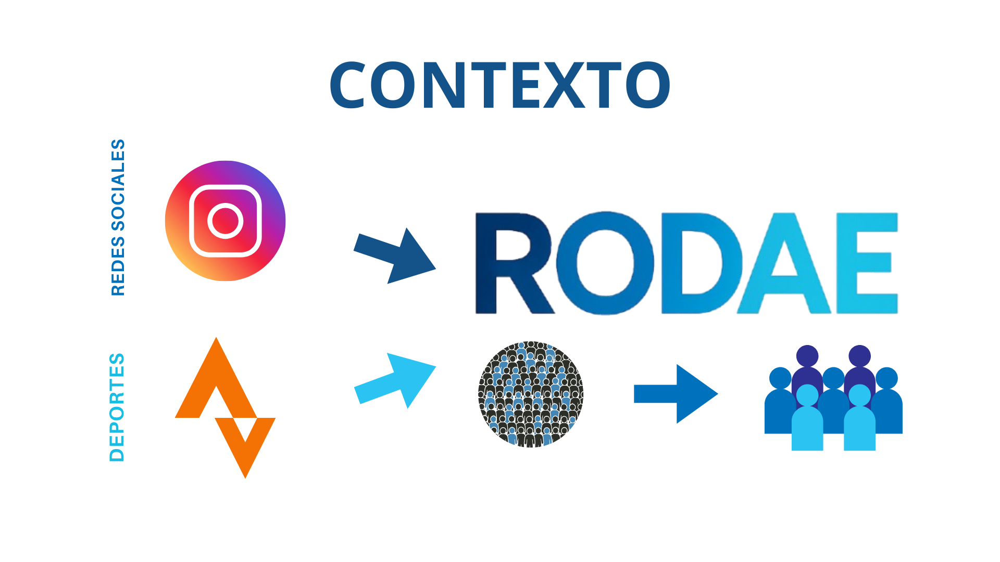
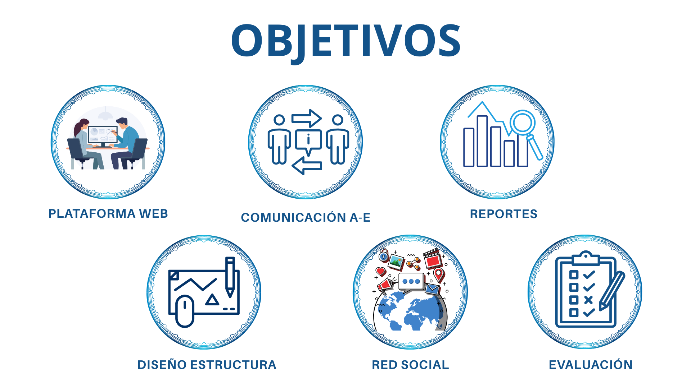
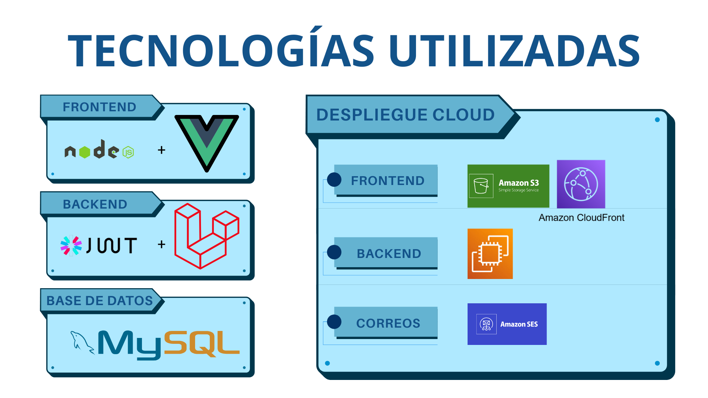
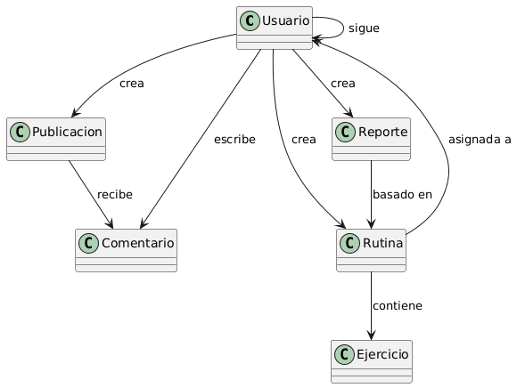
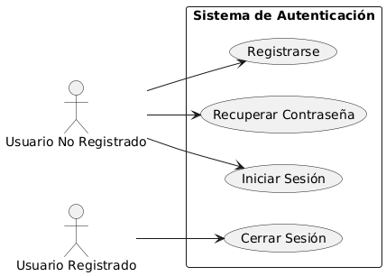
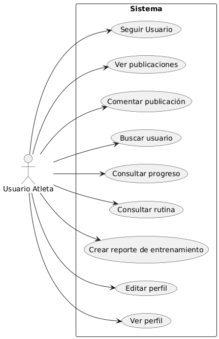
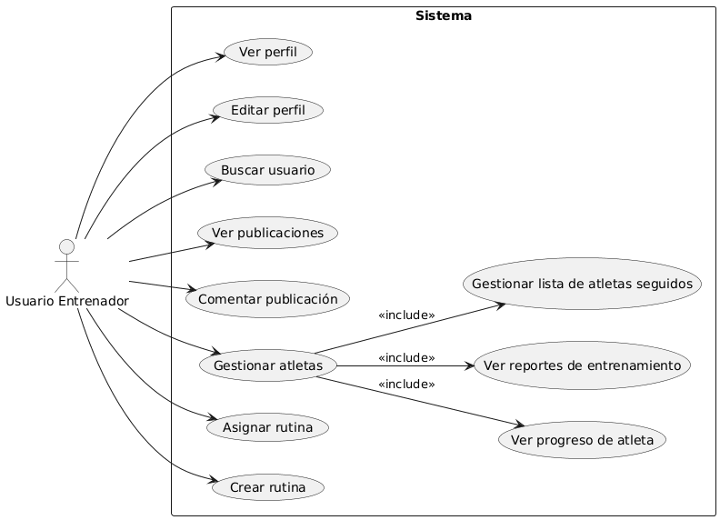
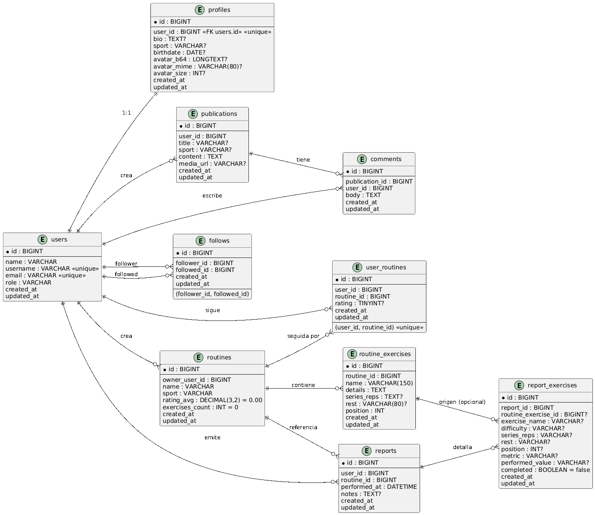

# RODAE  
**Red social centrada en actividades de Ocio Deportivo y la comunicación entre Atleta-Entrenador**  

Autor: Sergio Velarde Álvarez  
Tutor: José Manuel Breñosa

Universidad Europea del Atlántico — 2025  

---

Este Trabajo de Fin de Grado propone el desarrollo de **RODAE**, una plataforma que combina red social y herramientas de entrenamiento deportivo, diseñada para mejorar la comunicación entre atletas y entrenadores y fomentar la creación de comunidad alrededor de los deportes de fuerza.

---

## 1. Contexto
Vivimos en una sociedad cada vez más influenciada por las redes sociales.  
- Más de 4.75 mil millones de usuarios las utilizan en 2024.  
- Han impulsado la **vida saludable y el fitness**, con atletas, entrenadores e influencers compartiendo rutinas, progresos y consejos.  
- Sin embargo, las plataformas actuales no están especializadas en la **relación atleta-entrenador**, lo que genera una brecha en la gestión de entrenamientos.

---

## 2. Problema
Muchos usuarios utilizan redes como **Instagram, TikTok o Facebook** para mostrar sus entrenamientos.  
- Se crean cuentas a modo de **diario deportivo**.  
- No existen herramientas para **planificación estructurada** ni **seguimiento real**.  
- Los entrenadores y atletas dependen de **Excel, notas o apps no diseñadas para este fin**.

---

## 3. Solución
Aquí nace la semilla de **RODAE**. Esta aplicación tiene como base los siguientes objetivos.
### Objetivos

### Tecnologías utilizadas

---

## 5. Modelo de dominio
Incluye entidades principales como: **Usuario, Perfil, Rutina, Ejercicio, Reporte, Publicación, Comentario**.  

---

## 6. Casos de uso
Caso de uso **authentication**

Se diferencian dos perfiles principales:  
- **Usuario Atleta**: seguir rutinas, registrar reportes, compartir publicaciones.  
- **Usuario Entrenador**: crear y asignar rutinas, gestionar atletas, dar feedback.

---

## 7. Esquema Entidad-Relación
El diseño de la base de datos recoge las entidades del dominio y sus relaciones:  
- Relaciones usuario–rutina  
- Relación publicaciones–comentarios  
- Relación reportes–ejercicios  

---

## 8. Caso de uso detallado con demostración
Ejemplo: **Crear reporte de entrenamiento**  
- El atleta selecciona su rutina, marca los ejercicios completados, añade observaciones y guarda el progreso.  
- El reporte queda visible tanto para el atleta como para el entrenador.  

👉 **Demostración en vivo:** [Aplicación RODAE](https://d85ag4khyjpni.cloudfront.net/login)

---